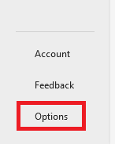
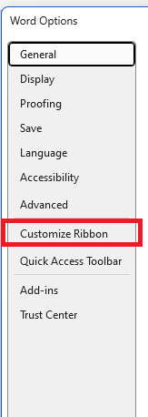
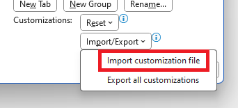
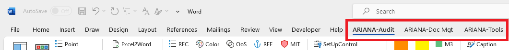
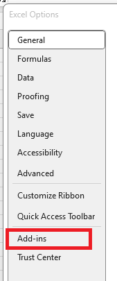
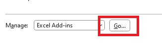

# ARIANA - Assistance for Reporting on Information system Audits with Normative Assessment

## Introduction 

ARIANA tool is created as an add on over Microsoft Word and Excel applications and enables an easy 
and reliable process for policies generation, audit report generation or updation, migration of record of processing 
and provides additional word and excel utilities useful for the consultants in day to day tasks. 
The tool was developed as a VBA application by itrust consulting for delivering standardized documentation in the ATENA project. 
The tool has being released as an open source as a CyFort project initiative with its key features being made available for usage and inviting 
further contributions.

## Installation

### Installing ARIANA on Microsoft Word

To install ARIANA tools, initially clone the GitHub repository contents into a local folder and copy the contents into ```C:\Users\<username>\AppData\Roaming\Microsoft\Templates```. 

Then, quit all Microsoft Office instances and launch Word. A full system reboot could be needed in order to complete the installation, if there are instances of Word running in the background.

#### Configuring ARIANA in Microsoft Word

After copying the files, it might not be possible yet to view the ARIANA-Tools Ribbon menu. If that is the case, perform the following steps:

1. Launch Microsoft Word;
2. Click on "Options" on the bottom-left side of the screen;



3. On the dialog box that will open, select the "Customize Ribbon" option to change the dialog box to the Ribon menu customization view



4. Click on the button "Import/Export" on the bottom-right side of the screen and select "Import customization file";



5. Navigate to the folder "Templates\SetUp" under ARIANA installation folder and select the file "SUP_Q010_ARIANA-Ribbon_v25.exportedUI";
6. The list of ribbon menus to be imported should now have three ARIANA items: ARIANA-Audit, ARIANA-Doc Mgt and ARIANA-Tools.

#### Checking the ARIANA installation

If the previous process was successful, the Ribbon Menu in word should now display the following new Ribbon menu items:



After making this verification, the tool is ready for generating new documents.

### Installing ARIANA on Microsoft Excel

To install ARIANA tools, initially clone the GitHub repository contents into a local folder and copy the file ```ARIANA-T.xlam```, found in the folder ```ITR-PACKAGE\Templates\SetUp``` into ```C:\Users\<username>\AppData\Roaming\Microsoft\AddIns```. 

Then, quit all Microsoft Office instances and launch Excel. A full system reboot could be needed in order to complete the installation, if there are instances of Excel running in the background.

#### Configuring ARIANA in Microsoft Excel

After copying the ```ARIANA-T.xlam``` file, Excel have to be configured to add the ARIANA Add-In. To do so, execute the following steps:

1. Click on "Options" on the bottom-left side of the window;


2. Select the "Add-Ins" option in the left side of the dialog box;

 

3. Click on the "Go..." button on the bottom of the dialog box;



4. Make sure that the checkbox by "ARIANA-T" is checked.

## User Guide
Refer to the [quick user guide](./UserGuide/5ADPUV24_STA_ARIANA-QS_v4.1.pdf) for getting started.

## License

Copyright © itrust consulting. All rights reserved.

Acknowledgment: This tool was co-funded by the Ministry of Economy and Foreign Trade of Luxembourg, within the project Cloud Cybersecurity Fortress of Open Resources and Tools for Resilience (CyFORT).  

Licensed under the GNU Affero General Public License (AGPL) v3.0.

## Contact

For more information about the project, contact us at dev@itrust.lu.
